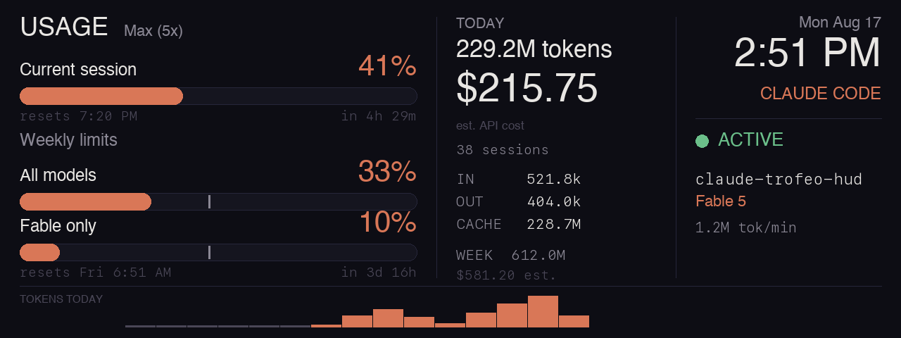

# trofeo-hud

**Repo:** <https://github.com/m-kk/trofeo-hud>

A desk HUD that shows live Claude usage on a Thermalright Trofeo Vision 6.86"
LCD (1280×480, USB-C, ~$38), driven from macOS. Inspired by the r/ClaudeAI
"$38 Claude LCD Table Display" post. Started as a fork of
[christensen143/claude-trofeo-hud](https://github.com/christensen143/claude-trofeo-hud)
and now developed independently here.



What it shows: Pro/Max session + weekly limit bars with reset countdowns
(from Anthropic's usage endpoint), today's tokens and estimated API cost
(via [ccusage](https://github.com/ryoppippi/ccusage)), the live session
(project, model, burn rate), a clock, and an hourly token sparkline.

### Reading the limit gauges

Each window is one row — label and percentage on a line, that row's bar
directly beneath it. Bar colour tracks the percentage only (amber past 80%,
red past 95%); it never encodes which model a window belongs to. The plan tier
sits next to the `USAGE` heading.

The white vertical mark standing proud of each bar is the **pace marker**: how
far through the window you already are. Fill short of the marker means you're
using the window slower than the clock is spending it; fill past it means
you'll run out before the reset.

It needs the window's full length, which is only meaningful if the reset is
anchored rather than sliding with use. Both are: sampled 12 minutes apart while
working, session utilization moved 22% → 31% while `resets_at` held at the same
second. A gauge whose window length is unknown renders without a marker rather
than guessing. One caveat on the 7-day bars: the span is assumed full, so if an
account's *first* weekly window is short, the marker is optimistic for that
window only.

The per-model weekly cap (`Fable only`) is absent on most accounts; when the
API doesn't report it, the row is dropped and the column closes up rather than
showing an empty bar.

## Requirements

- macOS, Python 3.12+, [uv](https://docs.astral.sh/uv/), Node (for `npx ccusage`)
- `brew install hidapi` (C library behind the `hidapi` Python package)
- Claude Code installed and logged in (the HUD reads its local logs and its
  OAuth token from the Keychain — read-only, nothing leaves your machine
  except the usage query to api.anthropic.com)

## Setup

```bash
git clone https://github.com/m-kk/trofeo-hud.git && cd trofeo-hud
uv sync
uv run trofeo-hud preview         # render mock layout to out/preview.png
uv run trofeo-hud run             # live HUD on the LCD (Ctrl-C stops)
uv run trofeo-hud install-agent   # start at login via launchd
```

(`python -m trofeo_hud …` is equivalent.)

On the first `run`, macOS asks for Keychain access to "Claude Code-credentials"
— choose **Always Allow** so the daemon can run unattended.

`uninstall-agent` stops and removes the launchd agent. Config lives in
[config.toml](config.toml) next to the project or `~/.config/trofeo-hud/config.toml`
(fps, JPEG quality, night dim/off hours; the pre-rename
`~/.config/claude-trofeo-hud/` location is still read as a fallback). Logs go to
`~/Library/Logs/trofeo-hud/`.

Upgrading from a `claude-trofeo-hud` checkout: run `install-agent` again — it
also stops and removes the old `com.varlogchris.claude-trofeo-hud` launchd
agent so two daemons don't fight over the panel.

## How it drives the display

The panel is not a monitor — it's a USB HID device (VID:PID `0416:5302`) that
accepts JPEG frames over a reverse-engineered protocol. We use the device
classes from [thermalright-trcc-linux](https://github.com/Lexonight1/thermalright-trcc-linux)
with its `HidApiTransport` (IOHIDManager), bypassing its CLI — trcc's default
transport routes through libusb, which macOS blocks for HID devices. The
firmware blanks when idle, so the HUD streams continuously (default 2 fps).
See [PLANNING.md](PLANNING.md) for the full protocol notes.

## Troubleshooting

- **"Access denied (insufficient permissions)"** — something is opening the
  device via libusb instead of hidapi; make sure you're running our CLI, not
  `trcc` directly.
- **Panel shows boot logo / blanks** — no frames arriving; check
  `~/Library/Logs/trofeo-hud/hud.log`. Unplug/replug is handled
  automatically with backoff.
- **Empty cost/tokens** — `npx ccusage` must work in a terminal first; the
  launchd agent bakes the node path into its plist at install time, so
  re-run `install-agent` after Node upgrades.
- **Limits stale** — Keychain access not granted, or you're logged out of
  Claude Code.
